<p align="center">
  
</p>

<h1 align="center">Bibline</h1>

<p align="center">
  <b>Frise chronologique biblique interactive</b><br>
  Parcourir plus de 6 000 ans d'histoire avec la même fluidité qu'une carte géographique.
</p>

<p align="center">
  <a href="https://mathieu-p12.github.io/Bibline/"></a>
  
  
  
</p>

<p align="center">
  <a href="https://mathieu-p12.github.io/Bibline/"><b>▶ Ouvrir Bibline</b></a>
</p>

<p align="center">
  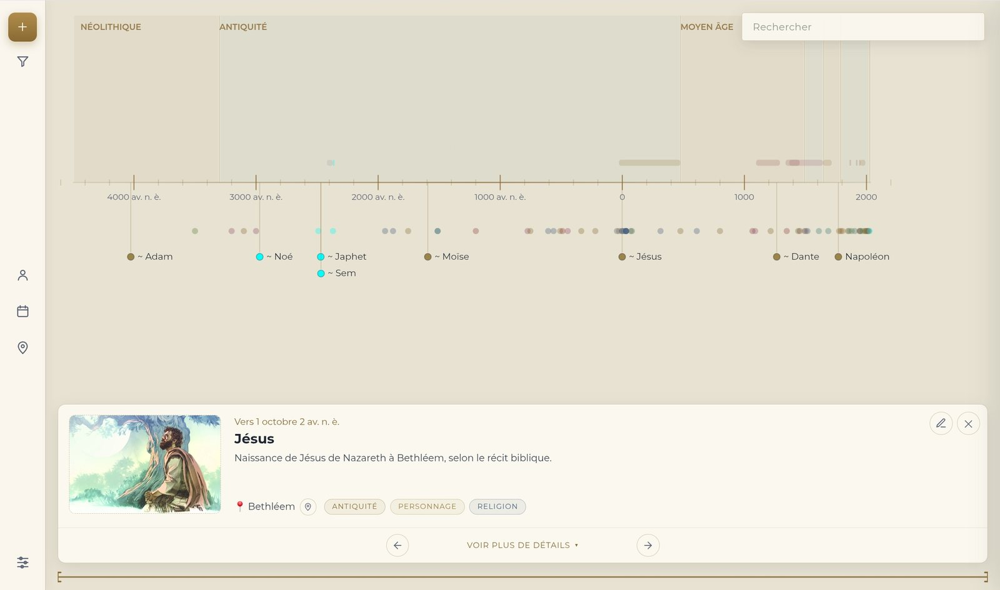
</p>

---

## Présentation

**Bibline** est une application web de gestion de connaissances chronologiques, centrée sur l'histoire biblique. Elle permet de créer, consulter et enrichir une frise qui s'étend de **-4500 à aujourd'hui**, en y rattachant des images, des descriptions, des références bibliques, des sources et des lieux.

L'idée de départ est simple : on navigue sur une carte en zoomant et en glissant, pourquoi pas sur le temps ? D'un coup d'œil sur les millénaires, un pincement suffit pour descendre jusqu'à l'année, au mois, voire au jour d'un événement.

> La chronologie des événements bibliques suit la chronologie traditionnelle telle que présentée sur [jw.org](https://www.jw.org).

## Aperçu

### Du millénaire… au jour près

| Vue d'ensemble | Zoom au jour près |
|:---:|:---:|
| 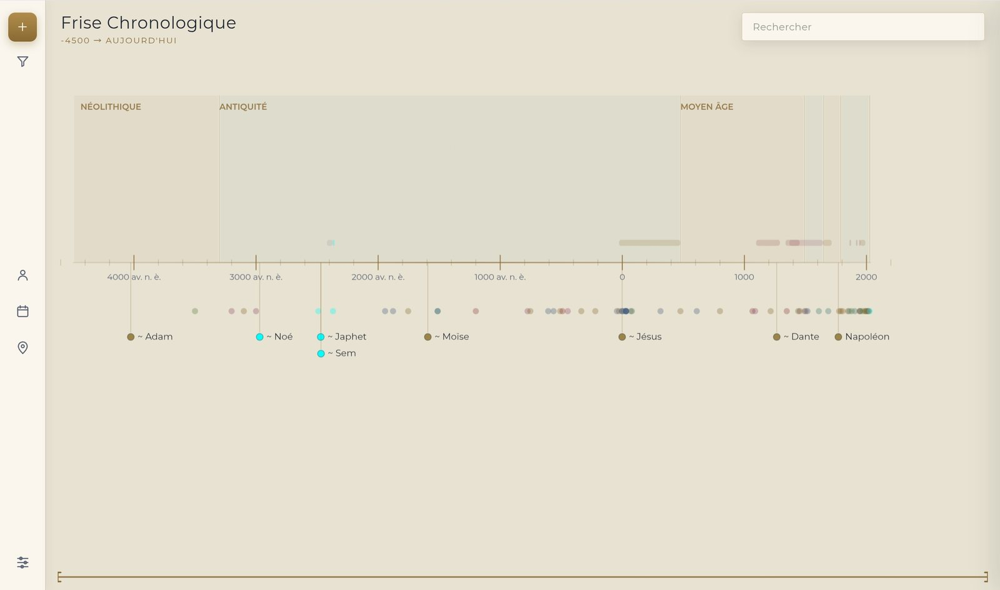 | 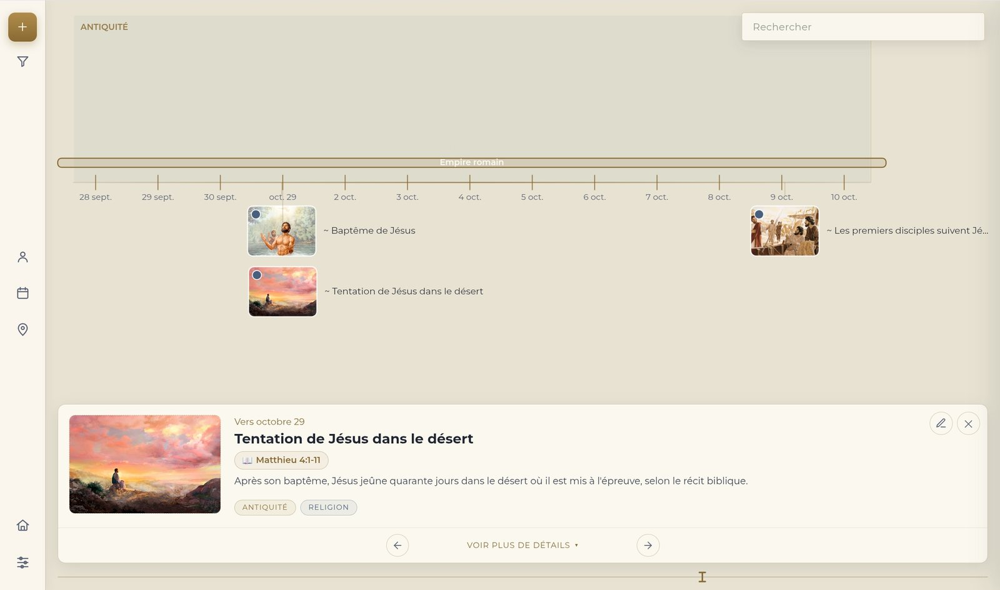 |
| Les époques en arrière-plan, les personnages mis en avant, le reste en retrait pour garder une vue lisible. | Graduations au jour, vignettes illustrées et fiche avec sa référence biblique cliquable. |

### Des fiches riches

| Fiche développée | Ajout d'un élément |
|:---:|:---:|
| 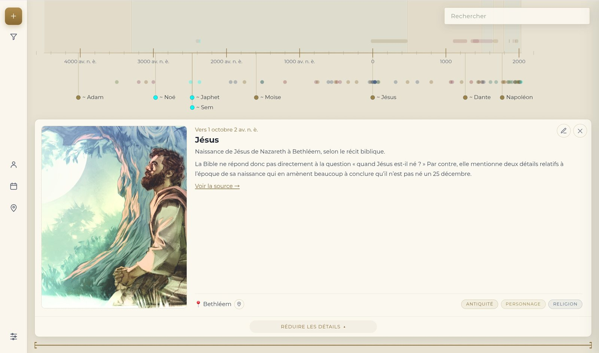 | 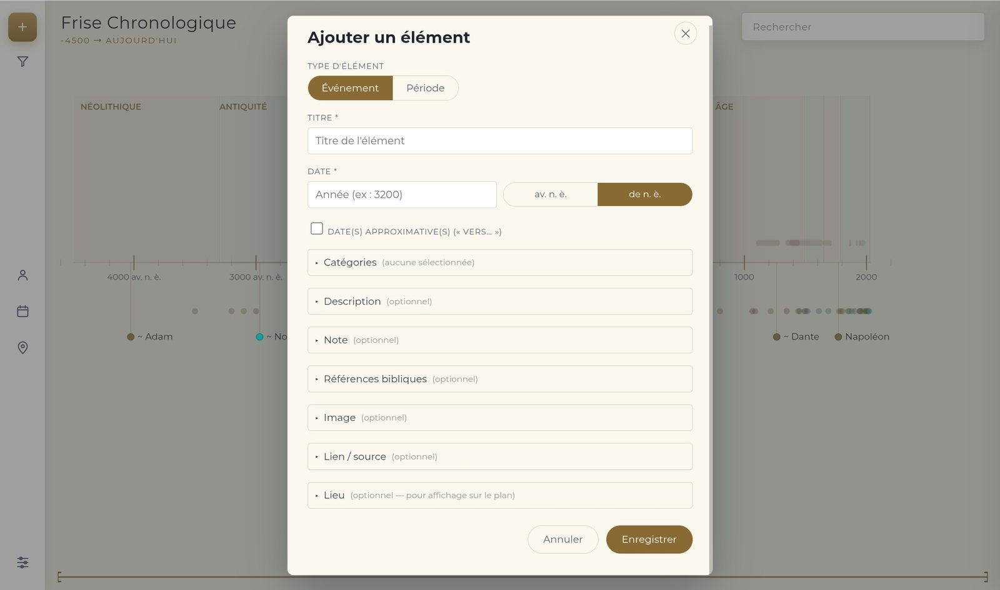 |
| Image, description, note, source, lieu et catégories multiples. | Formulaire en sections repliables : seul l'essentiel est visible au départ. |

### La carte

| Vue du monde | Vue rapprochée |
|:---:|:---:|
| 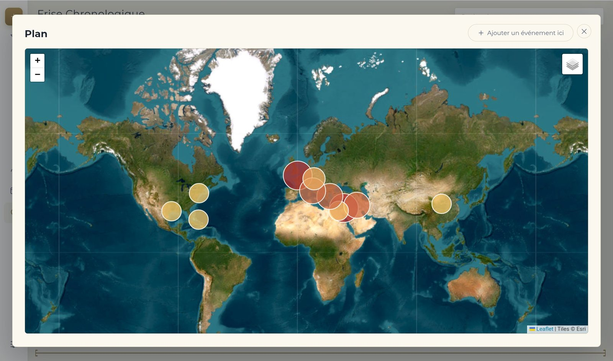 | 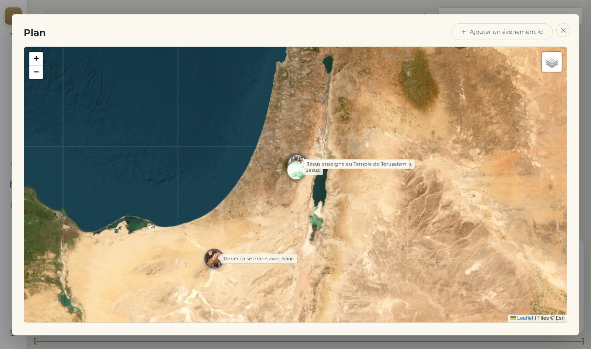 |
| De loin, des bulles de densité montrent où se concentre l'histoire. | De près, chaque événement apparaît avec sa photo ; un clic ramène sur la frise. |

### Listes, filtres et réglages

| Personnages | Toutes les dates |
|:---:|:---:|
| 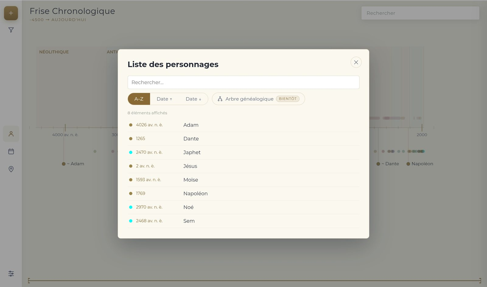 | 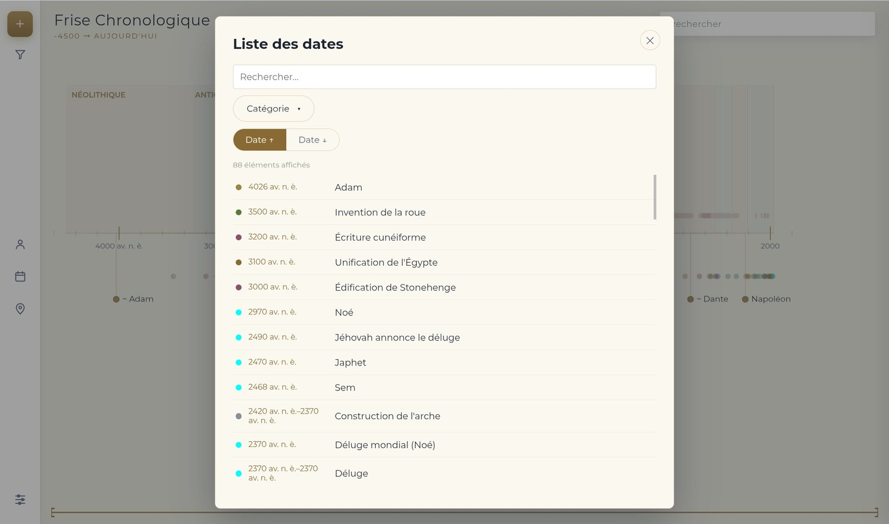 |

| Filtres par catégorie | Paramètres |
|:---:|:---:|
| 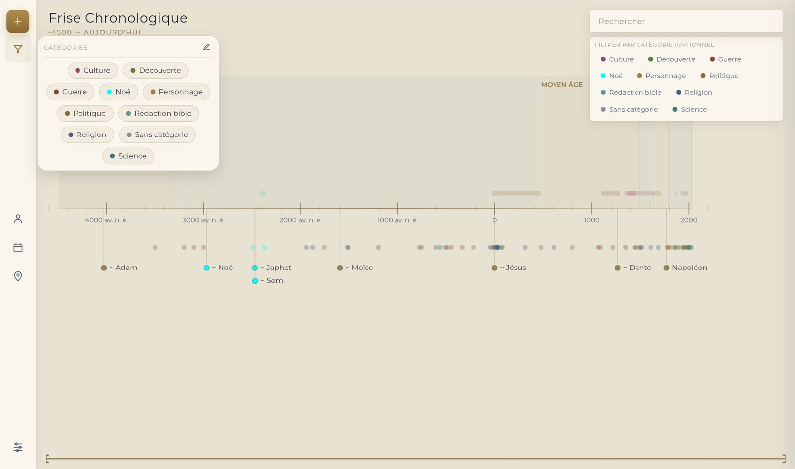 | 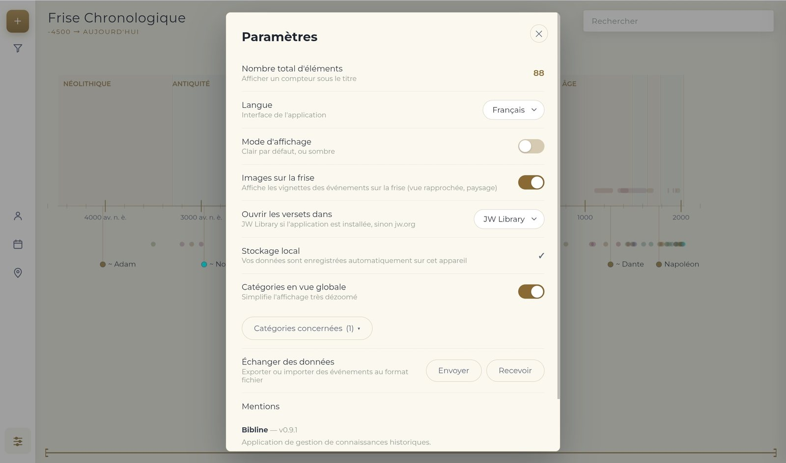 |

## Fonctionnalités

### Navigation dans le temps
- **Zoom et déplacement fluides** à la souris, à la molette, au doigt ou par pincement, avec inertie
- **Graduations adaptatives** : millénaires → siècles → années → mois → jours
- **Bandes d'époques** (Néolithique, Antiquité, Moyen Âge…) et **barres de périodes** empilées sans chevauchement
- **Vue globale simplifiée** : en fort dézoom, seules les catégories choisies restent au premier plan
- **Vignettes illustrées** sur la frise en vue rapprochée (désactivables)
- **Mini-carte** en bas de l'écran pour situer la portion affichée et y sauter d'un clic
- **Mise en page double** : paysage sur grand écran, portrait sur téléphone

### Contenu
- **Événements et périodes**, dates avant ou après notre ère, précises ou approximatives (« vers… »), jusqu'à l'heure près
- **Plusieurs catégories par élément** (ex. Noé → Personnage, Déluge, Lignée de Jésus)
- **Références bibliques** qui ouvrent le verset dans **JW Library**, ou sur jw.org si l'application n'est pas installée
- **Description, note personnelle, image** (fichier ou lien, avec cadrage), **source** et **lieu**
- **Catégories personnalisables** : couleur, nom, création à la volée
- **Listes** des personnages et de toutes les dates, avec recherche, filtre et tri

### Recherche
- Recherche instantanée, filtrable par catégorie
- Saisie d'une année (`1789`, `-3200`, `3200 av`) pour sauter directement à cette date
- La frise se centre automatiquement sur le résultat choisi

### Carte
- Fond **satellite** ou **plan** (OpenStreetMap)
- Trois niveaux d'affichage selon le zoom : densité, pastilles par catégorie, photos avec libellés
- **« Ajouter un événement ici »** : un clic sur la carte pré-remplit les coordonnées

### Données et confort
- **Fonctionne hors ligne** : application installable (PWA)
- **Sauvegarde automatique** sur l'appareil à chaque modification
- **Export / import** par catégorie, images incluses, pour sauvegarder ou partager
- **Mode clair / sombre**
- Interface en **français, anglais, espagnol et chinois**

## Installation

Aucune installation technique : Bibline s'ouvre dans un navigateur.

1. Ouvrez **[mathieu-p12.github.io/Bibline](https://mathieu-p12.github.io/Bibline/)**
2. Pour l'installer comme une application :
   - **Chrome / Edge (ordinateur)** : icône d'installation dans la barre d'adresse
   - **Android** : menu ⋮ → *Ajouter à l'écran d'accueil*
   - **iPhone / iPad (Safari)** : bouton Partager → *Sur l'écran d'accueil*
3. Une fois installée, l'application fonctionne sans connexion (les fonds de carte restent en ligne).

### Héberger votre propre copie

1. Forkez ce dépôt
2. Dans **Settings → Pages**, choisissez la branche `main` et le dossier racine `/`
3. Votre copie sera disponible sur `https://<votre-compte>.github.io/<nom-du-dépôt>/`

## Sauvegarder et partager ses données

Les données restent **sur votre appareil**. Pour les sauvegarder ou les transférer, ouvrez **Paramètres → Échanger des données** :

| Bouton | Effet |
|---|---|
| **Envoyer** | Télécharge un fichier contenant les éléments des catégories choisies et leurs images |
| **Recevoir** | Ajoute les éléments d'un fichier à votre frise, sans écraser l'existant |

## Sous le capot

| Brique | Rôle |
|---|---|
| **Canvas 2D** | Moteur de rendu de la frise : seuls les éléments visibles sont dessinés |
| **[Dexie.js](https://dexie.org)** | Stockage local persistant (IndexedDB) |
| **[Leaflet](https://leafletjs.com)** + OpenStreetMap / Esri | Carte interactive |
| **[JSZip](https://stuk.github.io/jszip/)** | Export / import des archives |
| **Service Worker** | Cache de l'application pour le fonctionnement hors ligne |

Aucun serveur, aucun compte, aucune dépendance à installer : du HTML, du CSS et du JavaScript.

```
├── index.html              Application (interface + moteur de frise)
├── manifest.json           Déclaration de l'application installable
├── sw.js                   Service worker (cache hors ligne)
├── icon-192.png            Icônes de l'application
├── icon-512.png
├── icon-512-maskable.png
└── docs/                   Logo et captures de ce README
```

## Feuille de route

- [x] Moteur de frise canvas avec zoom adaptatif jusqu'au jour
- [x] Carte interactive et ajout d'événements depuis la carte
- [x] Application installable, hors ligne, sauvegarde automatique
- [x] Export / import avec images
- [x] Plusieurs catégories par élément
- [x] Références bibliques ouvertes dans JW Library
- [ ] **Arbre généalogique** des personnages, relié à la frise
- [ ] Stockage dans un dossier du disque, synchronisable via un service cloud
- [ ] Application Android native

## À propos

Bibline est conçue par **Mathieu**, qui en porte la vision, le design et les retours d'usage. Le code a été écrit de façon itérative avec [Claude](https://claude.ai), l'assistant d'Anthropic.

Idées, remarques, bugs : ouvrez une [issue](../../issues).
